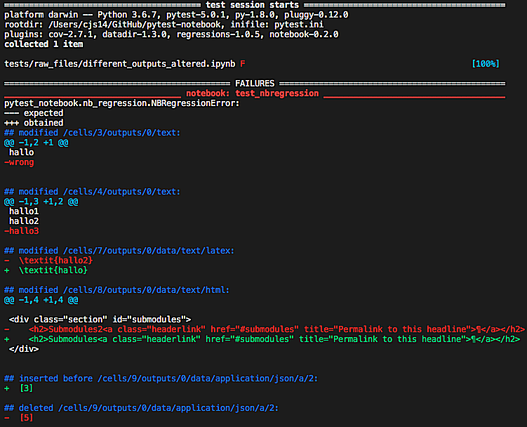
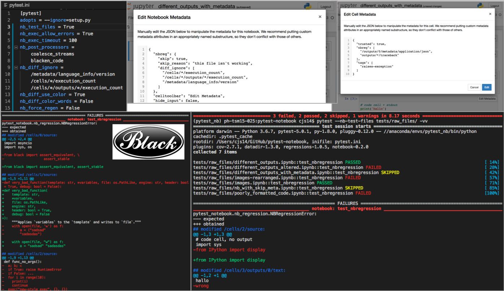

# pytest-notebook

[![CI][ci-badge]][ci-link]
[![Coverage][cov-badge]][cov-link]
[![RTD][rtd-badge]][rtd-link]
[![PyPI][pypi-badge]][pypi-link]
[![Conda][conda-badge]][conda-link]
[![Code style: black][black-badge]][black-link]

A [pytest](https://github.com/pytest-dev/pytest) plugin for regression testing and regenerating [Jupyter Notebooks](https://jupyter.org/).



------------------------------------------------------------------------

## Purpose

The purpose of the plugin is to ensure that changes to the python
environment (e.g. updating packages), have not affected the outputs
of the notebook. If the notebook has changed, this plugin can also
regenerate the notebooks, saving the new outputs.

## Features

- Recognise, collect, execute (optionally output) then diff input vs. output [Jupyter Notebooks](https://jupyter.org/).
- Provides clear and colorized diffs of the notebooks (using [nbdime](https://nbdime.readthedocs.io))
- Regenerate failing notebooks.
- Integration with [coverage](https://coverage.readthedocs.io) and [pytest_cov](https://pytest-cov.readthedocs.io).

- A well defined API allows notebook regression tests to be run:

    1. Using the pytest test collection architecture.
    2. As a pytest fixtures (`nb_regression.check(filename)`).
    3. Using the `pytest_notebook` python package.

- All stages are highly configurable *via*:

    1. The pytest command-line interface.
    2. The pytest configuration file.
    3. The notebook and cell level metadata.

- Post-processor plugin entry-points, allow for customisable modifications of the notebook,
  including source code formatting with [black](https://github.com/ambv/black)



## Installation

To install from [Conda](https://docs.conda.io) (recommended):

```shell
conda install -c conda-forge pytest-notebook
```

To install *via* [pip](https://pypi.org/project/pip/) from [PyPI](https://pypi.org/project):

```shell
pip install pytest-notebook
```

To install the development version:

```shell
git clone https://github.com/chrisjsewell/pytest-notebook .
cd pytest-notebook
pip install --upgrade pip
pip install -e .
# pip install -e .[code_style,testing,docs] # install extras for more features
```

## Usage

See the documentation at: http://pytest-notebook.readthedocs.io/

If you want to test some sample notebooks, add the `--nb-test-files` flag:

```shell
git clone https://github.com/chrisjsewell/pytest-notebook
cd pytest-notebook/examples
pip install pytest ipykernel pytest-notebook
pytest --nb-test-files *.ipynb
```

You should see `success.ipynb` passed the test and `fail.ipynb` failed the test.

You can regenerate the outputs of `fail.ipynb` with the `--nb-force-regen` flag:

```shell
pytest --nb-test-files --nb-force-regen *.ipynb
```

## Contributing

Contributions are very welcome.

The following will discover and run all unit test:

```shell
pip install -e .[testing]
pytest -v
```

### Coding Style Requirements

The code style is tested using [flake8](http://flake8.pycqa.org),
with the configuration set in `.flake8`,
and code should be formatted with [black](https://github.com/ambv/black).

Installing with `pytest-notebook[code_style]` makes the [pre-commit](https://pre-commit.com/)
package available, which will ensure these tests are passed by reformatting the code
and testing for lint errors before submitting a commit.
It can be setup by:

```shell
cd pytest-notebook
pre-commit install
```

Optionally you can run `black` and `flake8` separately:

```shell
black .
flake8 .
```

Editors like VS Code also have automatic code reformat utilities, which can adhere to this standard.

## License

Distributed under the terms of the [BSD-3](http://opensource.org/licenses/BSD-3-Clause) license,
`pytest-notebook` is free and open source software.

## Issues

If you encounter any problems, please [file an issue](https://github.com/chrisjsewell/pytest-notebook/issues) along with a detailed description.

## Acknowledgements

- [nbdime](https://nbdime.readthedocs.io)
- [nbval](https://github.com/computationalmodelling/nbval)

[ci-badge]: https://github.com/chrisjsewell/pytest-notebook/workflows/continuous-integration/badge.svg?branch=master
[ci-link]: https://github.com/chrisjsewell/pytest-notebook
[cov-badge]:https://codecov.io/gh/chrisjsewell/pytest-notebook/branch/master/graph/badge.svg
[cov-link]: https://codecov.io/gh/chrisjsewell/pytest-notebook
[rtd-badge]: https://readthedocs.org/projects/pytest-notebook/badge
[rtd-link]: http://pytest-notebook.readthedocs.io/
[pypi-badge]: https://img.shields.io/pypi/v/pytest-notebook.svg
[pypi-link]: https://pypi.org/project/pytest-notebook
[conda-badge]: https://anaconda.org/conda-forge/pytest-notebook/badges/version.svg
[conda-link]: https://anaconda.org/conda-forge/pytest-notebook
[black-badge]: https://img.shields.io/badge/code%20style-black-000000.svg
[black-link]: https://github.com/ambv/black
