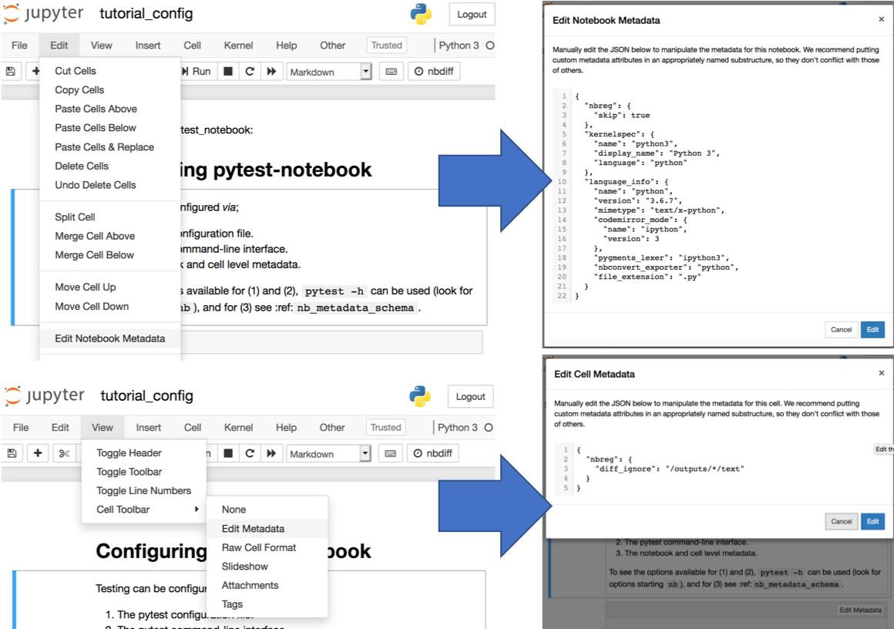
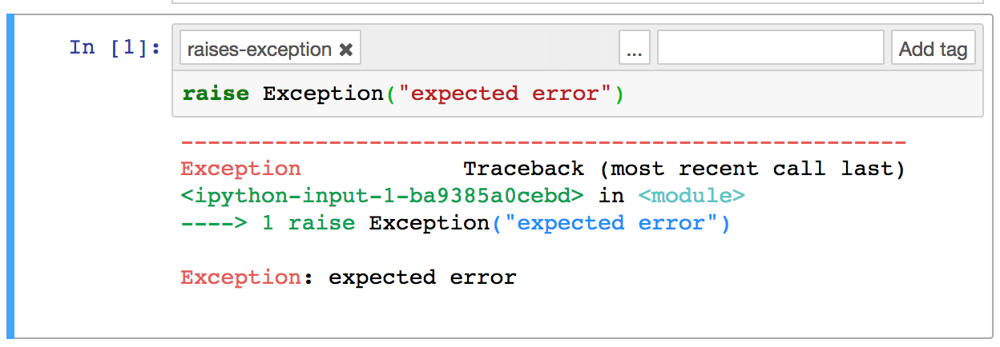

---
jupytext:
  text_representation:
    extension: .md
    format_name: myst
    format_version: 0.12
    jupytext_version: 1.6.0rc0
kernelspec:
  display_name: Python 3
  language: python
  name: python3
---

(configuring_pytest_notebook)=

# Configuring pytest-notebook

:::{seealso}
This notebook was rendered with [myst-nb](https://myst-nb.readthedocs.io): {nb-download}`tutorial_config.ipynb`
:::

+++

Testing can be configured *via*;

1. The pytest configuration file.
2. The pytest command-line interface.
3. The notebook and cell level metadata.

To see the options available for (1) and (2), `pytest -h` can be used (look for options starting `nb`), and for (3) see [](nb_metadata_schema).

+++

To access notebook metadata, either open the notebook as a text document, or use the Jupyter Notebook interface:



```{code-cell} ipython3
import nbformat
```

```{code-cell} ipython3
%load_ext pytest_notebook.ipy_magic
```

## Ignoring Elements of the Notebook

+++

When comparing the initial and final notebook,
differences are denoted by "paths" in the notebook;
a list of dictionary keys and list indices,
delimited by '/'.

```{code-cell} ipython3
notebook = nbformat.v4.new_notebook(
    cells=[
        nbformat.v4.new_code_cell("print(1)", execution_count=1, outputs=[]),
        nbformat.v4.new_code_cell(
            "print(1)",
            execution_count=3,
            outputs=[
                nbformat.v4.new_output(output_type="stream", name="stdout", text="2\n")
            ],
        ),
    ]
)
```

```{code-cell} ipython3
%%pytest --color=yes --show-capture=no --disable-warnings --nb-test-files

***
(nbformat.writes(notebook), "test_notebook1.ipynb")
***
```

We can set paths to ignore, in the configuration file,
notebook metadata, or cell metadata.

:::{note}
If the path is set in a cell metadata,
it should be relative to that cell,
i.e. /outputs not /cells/0/outputs
:::

```{code-cell} ipython3
notebook.metadata["nbreg"] = {"diff_ignore": ["/cells/0/outputs/"]}
notebook.cells[1].metadata["nbreg"] = {"diff_ignore": ["/outputs/0/text"]}
```

```{code-cell} ipython3
%%pytest --color=yes --show-capture=no --disable-warnings --nb-test-files

---
[pytest]
nb_diff_ignore =
    /metadata/language_info
    /cells/1/execution_count
---

***
(nbformat.writes(notebook), "test_notebook1.ipynb")
***
```

Wildcard `*` can also be used, in place of indices,
to apply to all indices in the list.

```{code-cell} ipython3
notebook2 = nbformat.v4.new_notebook(
    cells=[
        nbformat.v4.new_code_cell("print(1)", execution_count=1, outputs=[]),
        nbformat.v4.new_code_cell("print(1)", execution_count=2, outputs=[]),
    ]
)
```

```{code-cell} ipython3
%%pytest --color=yes --show-capture=no --disable-warnings --nb-test-files

---
[pytest]
nb_diff_ignore =
    /metadata/language_info
    /cells/*/outputs/
---

***
(nbformat.writes(notebook2), "test_notebook2.ipynb")
***
```

## Regex Pattern Replacement

+++

Rather than simply ignoring cells, we can apply regex replacements to sections of the notebook, before the diff comparison is made.
This is particularly useful for changeable outputs, such as dates and times:

```{code-cell} ipython3
notebook3 = nbformat.v4.new_notebook(
    cells=[
        nbformat.v4.new_code_cell(
            ("from datetime import date\n" "print(date.today())"),
            execution_count=1,
            outputs=[
                nbformat.v4.new_output(
                    output_type="stream", name="stdout", text="DATE-STAMP\n"
                )
            ],
        )
    ]
)
```

```{code-cell} ipython3
%%pytest --color=yes --show-capture=no --disable-warnings --nb-test-files

---
[pytest]
nb_diff_ignore =
    /metadata/language_info
---

***
(nbformat.writes(notebook3), "test_notebook3.ipynb")
***
```

```{code-cell} ipython3
%%pytest --color=yes --show-capture=no --disable-warnings --nb-test-files

---
[pytest]
nb_diff_ignore =
    /metadata/language_info
nb_diff_replace =
    /cells/*/outputs/*/text \d{2,4}-\d{1,2}-\d{1,2} "DATE-STAMP"
---

***
(nbformat.writes(notebook3), "test_notebook3.ipynb")
***
```

## Ignoring Exceptions

+++

To mark expected exceptions from a notebook cell, tag the cell as `raises-exception`:



```{code-cell} ipython3
notebook4 = nbformat.v4.new_notebook(
    cells=[
        nbformat.v4.new_code_cell(
            'raise Exception("expected error")',
            execution_count=1,
            outputs=[
                nbformat.v4.new_output(
                    output_type="error",
                    ename="Exception",
                    evalue="expected error",
                    traceback=[],
                )
            ],
        )
    ]
)
notebook4.metadata["nbreg"] = {
    "diff_ignore": ["/metadata/language_info", "/cells/0/outputs/0/traceback"]
}
```

```{code-cell} ipython3
%%pytest --color=yes --show-capture=no --disable-warnings --nb-test-files

***
(nbformat.writes(notebook4), "test_notebook4.ipynb")
***
```

```{code-cell} ipython3
notebook4.cells[0].metadata["tags"] = ["raises-exception"]
```

```{code-cell} ipython3
%%pytest --color=yes --disable-warnings --nb-test-files

***
(nbformat.writes(notebook4), "test_notebook4.ipynb")
***
```

## Skipping Notebooks

+++

To add the [pytest skip decorator](http://doc.pytest.org/en/latest/skipping.html#skipping-test-functions) to a notebook, you can add `skip=True` to the notebook metadata.

```{code-cell} ipython3
notebook5 = nbformat.v4.new_notebook()
notebook5.metadata["nbreg"] = {"skip": True, "skip_reason": "Not ready for testing."}
notebook5
```

```{code-cell} ipython3
%%pytest -v --color=yes -rs --nb-test-files

***
(nbformat.writes(notebook5), "test_notebook5.ipynb")
***
```

(post_processors)=

## Post-processors

+++

Post-processors are applied to the final notebook, before diff comparison. These can be added by external packages,
using the `nbreg.post_proc` group [entry point](https://docs.pytest.org/en/latest/writing_plugins.html#setuptools-entry-points):

```python
# setup.py
from setuptools import setup

setup(
    name="myproject",
    packages=["myproject"],
    entry_points={
        "nbreg.post_proc": [
            "blacken_code = post_processors:blacken_code"
    ]},
)
```

:::{seealso}
{py:mod}`pytest_notebook.post_processors`
for the internally provided plugins.
:::

+++

### Format Source Code

+++

An example of this is the `blacken_code` post-processor,
which applies the [black](https://github.com/ambv/black) formatter
to all source code cells.

This is particularly useful for re-generating notebooks.

```{code-cell} ipython3
notebook6 = nbformat.v4.new_notebook(
    cells=[
        nbformat.v4.new_code_cell(
            (
                "for i in range(5  ) :\n"
                "  x=i\n"
                "  a ='123'# comment\n"
                "c = ['a fairly long line of text', "
                "'another fairly long line of text',\n"
                "'yet another fairly long line of text']"
            ),
            execution_count=1,
            outputs=[],
        )
    ]
)
```

```{code-cell} ipython3
%%pytest --color=yes --disable-warnings --nb-test-files --nb-force-regen

---
[pytest]
nb_exec_notebook = False
nb_diff_ignore =
    /metadata/language_info
nb_post_processors =
    coalesce_streams
    blacken_code
---

***
(nbformat.writes(notebook6), "test_notebook6.ipynb")
***
```

### Format HTML/SVG outputs

+++

The {py:func}`~pytest_notebook.post_processors.beautifulsoup` post-processor may also be useful, for assessing differences in HTML and SVG outputs.

:::{note}
This requires [beautifulsoup4](https://beautiful-soup-4.readthedocs.io) to be installed.
:::
